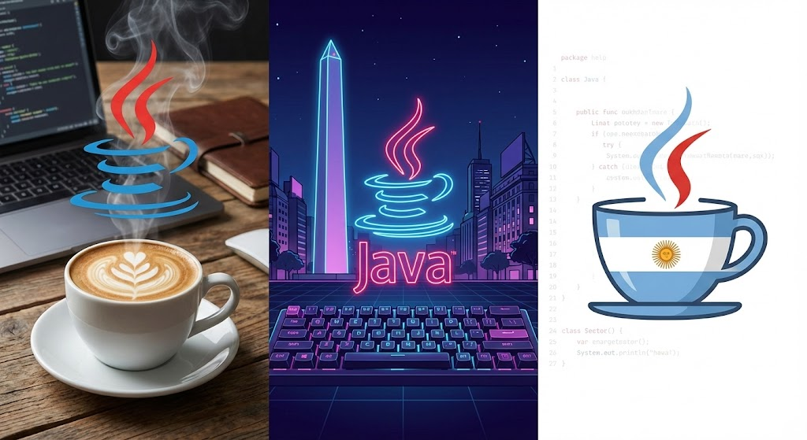

# Hi there, I'm BackArgJava 👋

**Backend Java Developer | API Architecture & Security | Freelancer**

I am a software engineer focused on designing and building secure, scalable backend architectures and robust RESTful APIs. I specialize in Java, Spring Boot, and relational database management. Because I also have practical experience with the modern frontend ecosystem (React/Vite), I architect endpoints that deliver data cleanly and efficiently, ensuring seamless integration for client-side engineering teams.

Currently, I am working as a freelancer based in **Buenos Aires, Argentina 🇦🇷**. I collaborate with international clients, offering seamless communication and highly compatible working hours for global and North American engineering teams.

### 🚀 What I'm Architecting
* 🧠 **Sentinel AI:** An enterprise-grade Spring Boot REST API featuring stateless JWT authentication, complex relational database mapping (MySQL), and secure Google Gemini AI prompt injection. It includes a decoupled React frontend to demonstrate the API's real-time capabilities.
* 🏰 **Disney API:** Architecting and developing a robust, scalable backend API service using Java and the Spring framework.
* ⚛️ **Client Integration:** Utilizing React and Vite to build functional, state-driven interfaces that act as test environments and visual proofs-of-concept for my backend architectures.
* 💬 **Global Communication:** Practicing advanced technical English to seamlessly integrate with international engineering teams.

### 💻 Tech Stack

**Backend, Architecture & Security:**

**Frontend Integration & UI:**

**Tools & Integrations:**

*Open to freelance backend opportunities and international collaborations. Let's build a solid foundation for your app.* 🌎
